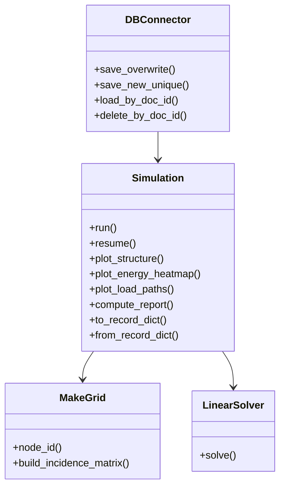
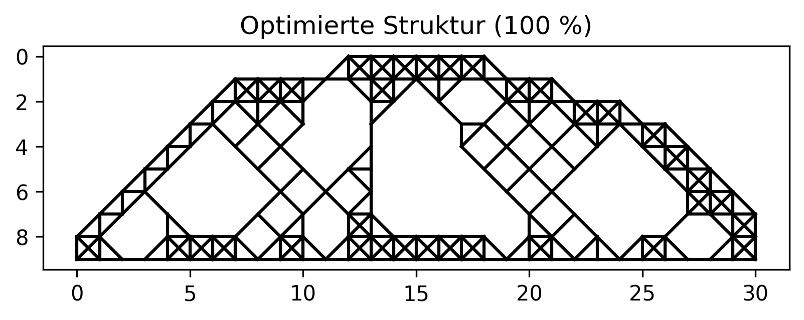

# 2D Topologieoptimierung mit Streamlit

Simulation mechanischer Strukturen &amp; Topologieoptimierung

Dieses Projekt implementiert eine interaktive 2D-Topologieoptimierung basierend auf einem Feder-Netzwerk-Modell (Finite-Elemente-ähnlicher Ansatz). Die Anwendung ermöglicht es, Strukturen zu optimieren, Lasten zu definieren und den Optimierungsprozess visuell darzustellen. Die Benutzeroberfläche wurde mit Streamlit umgesetzt.

## Funktionen

- Interaktive Definition des rechteckigen Bauraums (nx * ny)
- Frei definierbarer Kraftangriffspunkt und Kraftrichtung
- Definition von Randbedingungen (Festlager / Loslager)
- Iterative Topologieoptimierung durch Entfernen energiearmer Knoten
- Mechanische Stabilitätsprüfung (Konnektivität & Lastpfade)
- Visualisierung:
	- Ausgangsstruktur
	- Optimierungsschritte
	- Verformte Struktur
	- Iterationsverlauf relevanter physikalischer Größen
- Speichern, Laden und Löschen von Simulationen über TinyDB
- Fortsetzen gespeicherter Optimierungen
- Validierung am Beispiel des MBB-Balkens  

## Projektstruktur

```
project/
│
├── app.py              # Streamlit Benutzeroberfläche
├── main.py             # Orchestrierung der Simulation
├── simulation.py       # Kernlogik der Topologieoptimierung
├── grid.py             # Erzeugung & Verwaltung der Struktur (Graph)
├── solver.py           # Lösung des linearen Gleichungssystems (Ku = F)
├── user_input.py       # Verarbeitung & Validierung von UI-Eingaben
├── db_connector.py     # Datenbankanbindung (TinyDB)
│
├── db.json             # Datenbank (wird automatisch erzeugt)
├── mbb_balken.png      # Referenzbild MBB-Testfall
├── requirements.txt    # Python-Abhängigkeiten
└── README.md           # Projektdokumentation
```

## UML-Klassendiagramm



## Voraussetzungen und Installation

Für die Ausführung wird Python 3.10 oder neuer benötigt. Zusätzlich muss pip installiert sein. Die installierte Python-Version kann mit folgendem Befehl überprüft werden:

```bash
python --version
```

Anschließend muss das Repository heruntergeladen oder geklont werden:

```bash
git clone <repository-url>
cd <repository-ordner>
```

Es wird empfohlen, eine virtuelle Umgebung zu erstellen und zu aktivieren.

Windows:

```bash
python -m venv venv
venv\Scripts\activate
```

Mac / Linux:

```bash
python -m venv venv
source venv/bin/activate
```

Danach können die benötigten Abhängigkeiten installiert werden:

```bash
pip install -r requirements.txt
```

## Ausführung der Anwendung

Die Anwendung wird im Projektordner mit folgendem Befehl gestartet:

```bash
streamlit run app.py
```

Nach dem Start öffnet sich die Anwendung automatisch im Standardbrowser. Falls dies nicht geschieht, kann sie manuell unter folgender Adresse aufgerufen werden:

```
http://localhost:8501
```

## Verwendung

Nach dem Start der Anwendung können die Strukturgröße sowie der Kraftangriffspunkt und die Kraftrichtung über die Benutzeroberfläche definiert werden. Durch Klicken auf „Simulation starten“ wird die Optimierung ausgeführt. Die Originalstruktur, die einzelnen Optimierungsschritte und die resultierende verformte Struktur werden grafisch dargestellt. Simulationen können gespeichert und zu einem späteren Zeitpunkt wieder geladen und fortgesetzt werden.


## Validierung am Beispiel des MBB-Balkens

Zur Überprüfung und Validierung der Implementierung wurde das Benchmark-Problem des Messerschmitt–Bölkow–Blohm (MBB)-Balkens verwendet. Dieser Testfall ist als MBB Balken unter gespeicherten Runs in der UI zufinden. 

MBB Balken: 


## Speicherung

Simulationen werden beim Anklicken des Button Speichern im Web-UI in der Datei

```
db.json
```

gespeichert. Diese Datei wird beim ersten Speichern automatisch erstellt.

## Technische Details

Das zugrunde liegende Modell basiert auf einem Feder-Netzwerk mit globaler Steifigkeitsmatrix. Die Topologieoptimierung erfolgt durch iterative Entfernung von Knoten mit geringem Energiebeitrag unter Berücksichtigung von Konnektivität, Lastpfaden und mechanischer Stabilität. Zur Implementierung wurden die Bibliotheken NumPy, NetworkX, Matplotlib, Streamlit und TinyDB verwendet.

### Erweiterungen (implementiert)

- Interaktive Benutzeroberfläche (Streamlit) für:
  - Änderung von Gittergröße, Kraftposition, Kraftvektor, Zielmasse in Echtzeit
- Knotenenergie-Heatmap zur Visualisierung von tragenden Bereichen
- Lastpfadvisualisierung (Kraftfluss) mit einstellbarer Dicke je nach Belastung
- Speicherung, Laden und Löschen von Simulationen via TinyDB
- Export von Bildern (PNG) und Textreports
- Optimierungsverlauf: Masse, Compliance, Verschiebung, Anzahl Knoten und Elemente pro Iteration

## Autoren

Kevin Geisler, Konstantin Gneuß